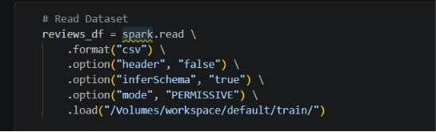
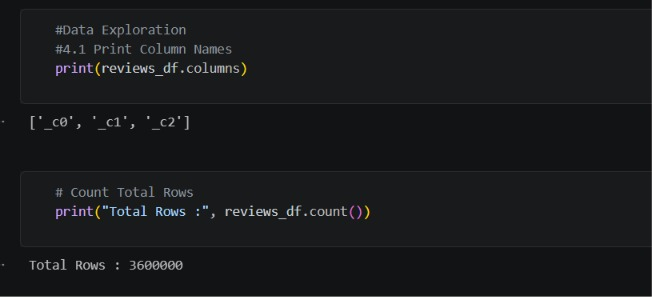
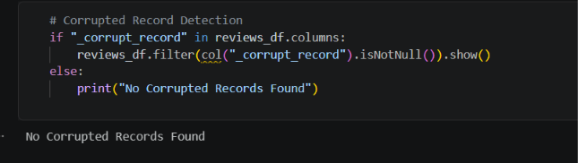
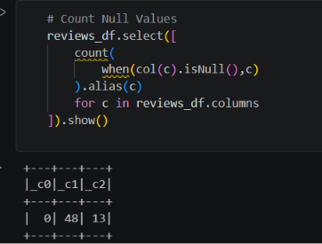
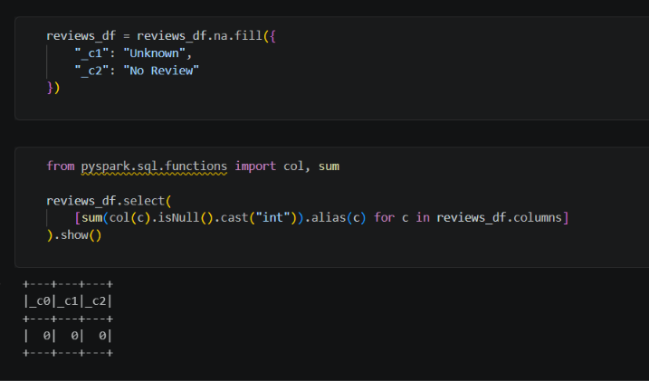
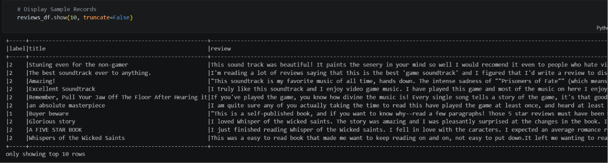
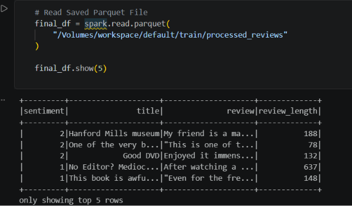

# Amazon Reviews Spark Project 2026

## Project Overview
Amazon Reviews Data Processing using Apache Spark and Databricks. The project includes data exploration, corrupted record detection, null value handling, data transformation, and Parquet storage.

## Dataset Upload

## Data Exploration

## Corrupted Records Check

## Null Values Before Cleaning

## Null Values After Cleaning

## Final Data Preview

## Parquet Output

